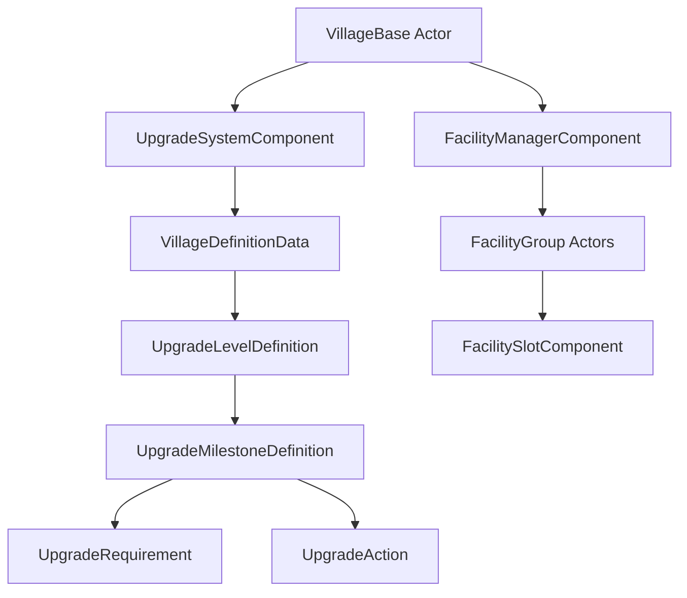

# Base Upgrade System

The **PangeaBaseUpgradeSystem** module provides a flexible, data-driven framework for managing base/village progression, facility unlocking, and milestone-based upgrade mechanics.

## Overview

The Base Upgrade System allows designers to create complex upgrade progression trees where:
- Players upgrade their base from level to level
- Each level can have multiple milestones with custom requirements
- Milestones can unlock facilities, grant items, or trigger custom actions
- All configuration is done through Data Assets, no C++ required for content

## Core Concepts

### Village/Base Levels
The system tracks a numeric level for each base (starting at 0). As the level increases, new facilities and features become available.

### Milestones
Each level can contain multiple milestones. A milestone is a logical grouping of:
- **Requirements**: Conditions that must be met (e.g., "Have 50 Wood", "Complete Quest X")
- **Actions**: Effects that occur when requirements are satisfied (e.g., "Unlock Blacksmith", "Grant 100 Gold")

### Facilities
Facilities are groups of actors (NPCs, decorations, interactables) that can be enabled or disabled. They're identified by Gameplay Tags and can be unlocked through milestone actions.

### Requirements
Requirements are modular `UObject` classes that check if specific conditions are met. The system includes built-in requirements and supports custom Blueprint or C++ requirements.

### Actions
Actions are modular `UObject` classes that execute when a milestone is completed. They can unlock facilities, grant items, trigger events, or perform custom logic.

## Architecture

## Key Classes

| Class | Purpose |
|-------|---------|
| `AVillageBase` | Main actor representing the player's base |
| `UUpgradeSystemComponent` | Manages level progression and milestone execution |
| `UFacilityManagerComponent` | Tracks and enables/disables facility groups |
| `UVillageDefinitionData` | Data Asset defining all levels and milestones |
| `AFacilityGroup` | Actor containing multiple facility slots |
| `UFacilitySlotComponent` | Component that spawns a specific actor when enabled |
| `UUpgradeRequirement` | Base class for requirement checks |
| `UUpgradeAction` | Base class for actions to execute |

## Workflow

### For Designers

1. **Create a Village Definition Data Asset**
   - Right-click in Content Browser → Miscellaneous → Data Asset → `VillageDefinitionData`
   
2. **Configure Levels**
   - Add entries to the `Levels` array
   - Set the level number for each entry

3. **Add Milestones**
   - For each level, add milestones
   - Give each milestone a unique Gameplay Tag

4. **Configure Requirements**
   - Add requirement objects (e.g., `Req_HasItems`, `Req_QuestCompleted`)
   - Configure the specific values for each requirement

5. **Configure Actions**
   - Add action objects (e.g., `UA_EnableFacility`, `UA_GrantInventory`)
   - Configure what happens when the milestone is complete

6. **Set up Facility Groups**
   - Place `AFacilityGroup` actors in your level
   - Add `UFacilitySlotComponent` for each actor you want to spawn
   - Tag each facility group with a Gameplay Tag

7. **Assign to Village Base**
   - Place or configure your `AVillageBase` actor
   - Assign the `VillageDefinitionData` to the UpgradeSystemComponent

### For Programmers

1. **Extending Requirements**
   - Inherit from `UUpgradeRequirement`
   - Override `IsRequirementMet_Implementation()`
   - Add properties for designer configuration

2. **Extending Actions**
   - Inherit from `UUpgradeAction`
   - Override `Execute_Implementation()`
   - Perform your custom logic

3. **Integrating with Other Systems**
   - Get reference to `UUpgradeSystemComponent`
   - Call `OnLevelIncreased()` when player levels up
   - Check `CanUpgradeToNextLevel()` for UI feedback
   - Query milestone completion with `IsMilestoneCompleted()`

## Next Steps

- [Components Reference](base-upgrade-components.md) - Detailed component documentation
- [Data Assets](base-upgrade-data-assets.md) - How to configure upgrade data
- [Requirements & Actions](base-upgrade-requirements-actions.md) - Built-in and custom types
- [Integration Guide](base-upgrade-integration.md) - Connecting to your game systems

