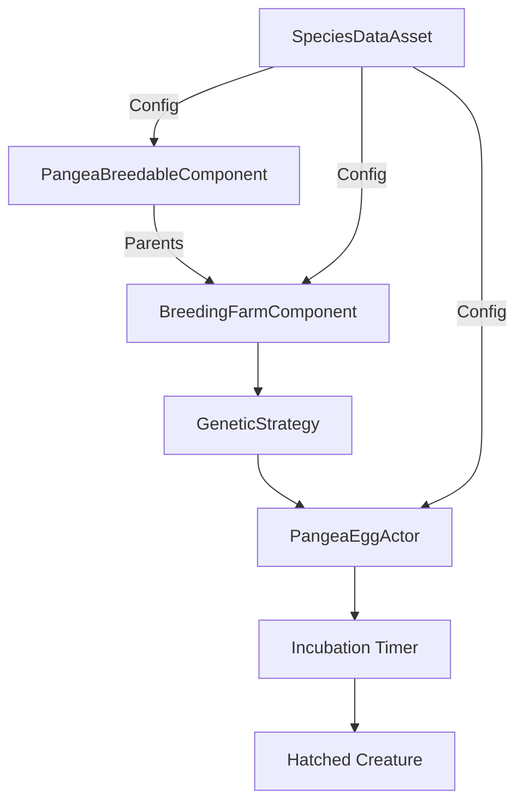

# Breeding System

The **PangeaBreedingSystem** module provides a comprehensive genetic breeding system for dinosaurs, featuring trait inheritance, visual gene mixing, and egg incubation mechanics.

## Overview

The Breeding System allows players to:
- Breed two compatible dinosaurs (male + female)
- Produce eggs with genetic traits inherited from both parents
- Incubate eggs over time
- Hatch offspring with mixed visual characteristics
- Manage fertility cooldowns between breeding attempts

## Core Concepts

### Genetic Traits

Traits are named numeric values that represent characteristics of a creature (e.g., Strength, Speed, Size). When two creatures breed, their traits are combined using a **Genetic Strategy** to produce offspring traits.

### Parent Snapshots

Before breeding, the system captures a "snapshot" of each parent containing:
- Species ID
- Creature unique ID
- All genetic traits
- Visual data (colors, patterns)
- Material parameters

### Genetic Strategy

A pluggable `UObject` that defines **how** traits are combined. The default implementation can:
- Average parent traits
- Apply random mutations
- Bias toward one parent
- Clamp values to valid ranges

You can create custom strategies in Blueprint or C++ for different breeding behaviors.

### Visual Inheritance

Beyond stats, offspring inherit visual characteristics:
- Material color parameters (skin, patterns, eyes)
- Blended between parents with mutation chances
- Configurable per-species via `MaterialGeneticGroups`

### Fertility System

After breeding, creatures enter a cooldown period:
- Prevents immediate re-breeding
- Configurable duration per species
- Can affect one or both parents
- Events fired for UI updates

### Breeding Farm

A `UPangeaBreedingFarmComponent` manages a breeding zone:
- Tracks creatures within the zone
- Handles breeding between compatible pairs
- Spawns eggs at a specified location
- Manages the incubation timer

## Architecture



## Key Classes

| Class | Purpose |
|-------|---------|
| `UPangeaBreedableComponent` | Marks a creature as breedable, stores genetic traits |
| `UPangeaBreedingFarmComponent` | Manages breeding zone and breeding attempts |
| `APangeaEggActor` | Represents an egg during incubation |
| `UPangeaSpeciesDataAsset` | Per-species breeding configuration |
| `UPangeaGeneticStrategy` | Defines how parent traits combine |
| `FGeneticTraitSet` | Container for named trait values |
| `FParentSnapshot` | Captured parent data for breeding |

## Workflow

### For Designers

1. **Create Species Data Asset**
   - Configure incubation time
   - Set fertility cooldown
   - Define material genetic groups
   - Set creature class to spawn

2. **Assign to Creatures**
   - Add `UPangeaBreedableComponent` to dinosaur
   - Set `SpeciesData` reference
   - Set gender (Male/Female)
   - Configure initial traits (optional)

3. **Set Up Breeding Farm**
   - Add `UPangeaBreedingFarmComponent` to farm actor
   - Assign breeding zone box component
   - Set egg class
   - Optionally assign custom genetic strategy

4. **Test Breeding**
   - Place male and female in zone
   - Call `TryBreed()` or use Blueprint logic
   - Egg spawns and begins incubation
   - Wait for hatch timer to complete

### For Programmers

1. **Extend Genetic Strategy**
   - Inherit from `UPangeaGeneticStrategy`
   - Override `CombineTraits()`
   - Implement custom mixing logic

2. **Custom Trait Sources**
   - Override `PullAttributesIntoTraits()` in breedable component
   - Pull from GAS attributes, equipment, buffs, etc.

3. **Integrate with Save System**
   - `UPangeaBreedableComponent` properties are marked `SaveGame`
   - Eggs save parent snapshots and trait data
   - Use provided save interfaces

4. **UI Integration**
   - Listen to `OnBred` event on breedable component
   - Subscribe to `OnEggProgress` on egg actor
   - Display fertility cooldown via `OnFertilityCooldownTick`

## Example Use Cases

### Basic Breeding

```cpp
// Get two breedable creatures
UPangeaBreedableComponent* Male = MaleDinosaur->FindComponentByClass<UPangeaBreedableComponent>();
UPangeaBreedableComponent* Female = FemaleDinosaur->FindComponentByClass<UPangeaBreedableComponent>();

// Breed them via farm
APangeaEggActor* Egg = Farm->BreedingFarmComponent->TryBreed(Male, Female);

if (Egg)
{
    // Success! Egg is incubating
}
```

### Custom Genetic Strategy

```cpp
UCLASS()
class UMyGeneticStrategy : public UPangeaGeneticStrategy
{
    GENERATED_BODY()

public:
    virtual FGeneticTraitSet CombineTraits_Implementation(
        const FParentSnapshot& ParentA,
        const FParentSnapshot& ParentB) const override
    {
        FGeneticTraitSet Result;
        
        // Custom logic: dominant/recessive genes
        // More complex than simple averaging
        
        return Result;
    }
};
```

### Trait-Based Stat System

```cpp
void UPangeaBreedableComponent::PullAttributesIntoTraits_Implementation(FGeneticTraitSet& InOutTraits) const
{
    if (!ACFAttributes)
        return;

    // Pull GAS attributes into genetic traits
    InOutTraits.SetValue("Strength", ACFAttributes->GetAttributeValue("Strength"));
    InOutTraits.SetValue("Speed", ACFAttributes->GetAttributeValue("Speed"));
    InOutTraits.SetValue("Health", ACFAttributes->GetAttributeValue("MaxHealth"));
}
```

## Next Steps

- [Components Reference](breeding-components.md) - Detailed component API
- [Genetics System](breeding-genetics.md) - How trait inheritance works
- [Breeding Farm](breeding-farm.md) - Setting up breeding zones
- [Integration Guide](breeding-integration.md) - Connecting to your game

