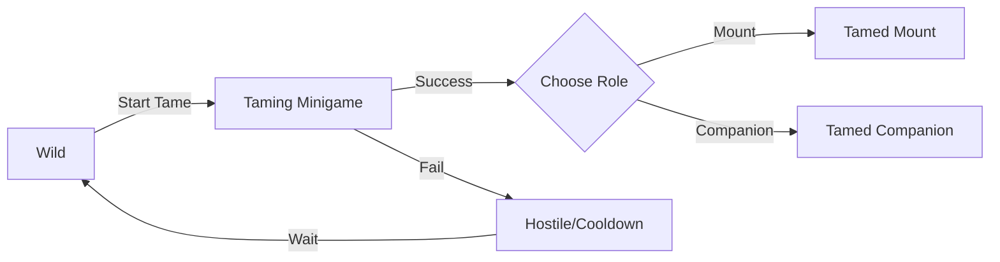

# Taming System

The **PangeaTamingSystem** module implements mechanics for taming wild dinosaurs, managing tame states, and assigning roles to tamed creatures.

## Overview

The Taming System provides:
- **State-based taming**: Wild → Hostile → Tamed transitions
- **Role assignment**: Mount or Companion roles for tamed creatures  
- **Requirement checking**: Stat and item requirements for taming
- **Minigame support**: Integrate custom taming minigames
- **GAS integration**: Uses Gameplay Ability System for abilities and tags
- **AI controller switching**: Different AI behaviors based on state/role
- **Team management**: Automatic team switching on tame

## Core Concepts

### Tame States

| State | Description |
|-------|-------------|
| **Wild** | Natural, non-aggressive state. Can be tamed. |
| **Hostile** | Aggressive toward player. Must be calmed before taming. |
| **Tamed** | Successfully tamed, belongs to player. |

### Tamed Roles

| Role | Description |
|------|-------------|
| **None** | No role assigned (temporary state) |
| **Mount** | Can be ridden by player |
| **Companion** | Follows and fights alongside player |

### Taming Flow



## Architecture

```
UPangeaTamingComponent
├── TameSpeciesConfig (Data Asset)
│   ├── Requirements (Stats, Items)
│   ├── Behavior (Duration, Cooldown)
│   ├── GAS Integration (Abilities, Effects)
│   └── Gameplay Tags (States, Roles, Teams)
├── State Management
│   ├── InitializeWild()
│   ├── InitializeHostile()
│   ├── StartTameAttempt()
│   └── OnTameResolved()
└── Role Management
    ├── SetTamedRole()
    ├── Team Switching
    └── AI Controller Switching
```

## Key Classes

| Class | Purpose |
|-------|---------|
| `UPangeaTamingComponent` | Main component for tameable creatures |
| `UTameSpeciesConfig` | Data asset defining species taming parameters |
| `UPangeaTamingAbility` | GAS ability for taming actions |
| `UTamingWidget` | UI for taming minigame |
| `ETameState` | Enum: Wild, Hostile, Tamed |
| `ETamedRole` | Enum: None, Mount, Companion |

## Configuration

### Species Data Asset

Create `DA_RaptorTameConfig`:

**Requirements**:
- Required Item: `Meat` x5
- Minimum Dexterity: 15
- Minimum Strength: 10

**Behavior**:
- Tame Duration: 5 seconds
- Retry Cooldown: 10 seconds
- Run Away on Fail: Yes

**Roles**:
- Can Be Mount: Yes (AI: `MountAI_Controller`)
- Can Be Companion: Yes (AI: `CompanionAI_Controller`)

**GAS**:
- Abilities Granted: `Ability_RaptorRoar`, `Ability_RaptorPounce`
- Effects on Success: `GE_TameSuccess_Buff`

## Usage

### Basic Taming

```cpp
// Player initiates tame
void APlayerCharacter::InteractWithDinosaur(APDDinosaurBase* Dinosaur)
{
    UPangeaTamingComponent* TamingComp = Dinosaur->FindComponentByClass<UPangeaTamingComponent>();
    if (!TamingComp)
        return;

    // Check if can tame
    if (TamingComp->GetTameState() != ETameState::Wild)
    {
        ShowMessage("Creature is not tameable right now");
        return;
    }

    // Start taming attempt
    TamingComp->StartTameAttempt(this);
}

// Taming resolved (from minigame)
void OnMinigameCompleted(bool bSuccess, ETamedRole DesiredRole)
{
    TamingComp->OnTameResolved(bSuccess, DesiredRole);
}
```

## Next Steps

- [Taming Component](taming-component.md) - Component API reference
- [Taming Config](taming-config.md) - Species configuration
- [States & Roles](taming-states-roles.md) - State management details
- [Integration Guide](taming-integration.md) - Full game integration

